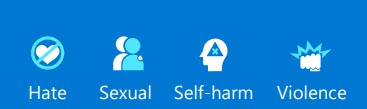

# Microsoft Certified: Azure AI Engineer Associate (AI-102)
- ### Microsoft Learn [link](https://learn.microsoft.com/en-us/credentials/certifications/azure-ai-engineer)

## [Get started with Azure AI Services](https://learn.microsoft.com/en-us/training/paths/get-started-azure-ai/)

- ### [Plan and prepare to develop AI solutions on Azure](https://learn.microsoft.com/en-us/training/modules/prepare-azure-ai-development/)
    - **Hubs**: A hub provides a centrally managed collection of shared resources and management configuration for AI solution development. You need at least one hub to use all of the solution development features and capabilities of AI Foundry. When you create a Azure AI Hub, four additional resources are created: A multi-service Azure AI Services, a KeyVault, a Storage Account and (optionally) an Azure AI Search.
    - **Projects**: A hub can support one or more projects, each of which is used to organize the resources and assets required for a particular AI development effort.
    - **Azure AI Developer** role: All permissions except create new hubs and manage the hub permissions.
    - **Azure AI Inference Deployment Operator** role : All permissions required to create a resource deployment within a resource group.
    - **Responsible AI**
        - Fairness
        - Reliability and safety
        - Privacy and security
        - Inclusiveness
        - Transparency
        - Accountability

- ### [Create and consume Azure AI services](https://learn.microsoft.com/en-us/training/modules/create-manage-ai-services/)
    - You can provision an AI services resource that supports multiple different AI services. For example, you could create a single resource that enables you to use the Azure AI Language, Azure AI Vision, Azure AI Speech, and other services.
    - To consume the service through the endpoint, applications require the following information:
        - **The endpoint URI**. This is the HTTP address at which the REST interface for the service can be accessed.
        - **A subscription key**. Access to the endpoint is restricted based on a subscription key. Client applications must provide a valid key to consume the service. 
        - **The resource location**. When you provision a resource in Azure, you generally assign it to a location, which determines the Azure data center in which the resource is defined.
    - Azure AI services provide **REST** application programming interfaces (APIs) that client applications can use to consume services.

- ### [Secure Azure AI services](https://learn.microsoft.com/en-us/training/modules/secure-ai-services/)
    - **Regenerate keys**: You should regenerate keys regularly to protect against the risk of keys being shared with or accessed by unauthorized users. You can regenerate keys using the Azure portal, or using the az cognitiveservices account keys regenerate Azure command-line interface (CLI) command.
    - **Azure Key Vault**: Azure Key Vault is an Azure service in which you can securely store secrets (such as passwords and keys). Access to the key vault is granted to security principals, which you can think of user identities that are authenticated using Microsoft Entra ID. Administrators can assign a security principal to an application (in which case it is known as a service principal) to define a managed identity for the application.
    - Authenticate using service principals: Assign the *Cognitive Services Users* role.
    - Authenticate using managed identities: We have two types, System-assigned managed identity and User-assigned managed identity, you give the *Cognitive Services Contributor* role.
    - Configuring network access restrictions: 
        - **Selected Networks and Private Endpoints**: Blocks connections to the resource, unless a rule allows access to it. These rules can be set for Azure virtual networks, IP addresses, CIDR, or Private Endpoints. 
        - **Disabled**: Blocks all traffic to the resource. You can still add access to Private Endpoints. This is the most restrictive option.
- ### [Monitor Azure AI services](https://learn.microsoft.com/en-us/training/modules/monitor-ai-services/)
    - **Azure Event Hubs** allows you to forward the data on to a custom telemetry solution and connect directly to some third-party solutions. However, in most cases you'll use one (or both) of the following kinds of resource within your Azure subscription:
        - **Azure Log Analytics**: a service that enables you to query and visualize log data within the Azure portal.
        - **Azure Storage**: a cloud-based data store that you can use to store log archives.
- ### [Deploy Azure AI services in containers](https://learn.microsoft.com/en-us/training/modules/investigate-container-for-use-with-ai-services/)
    - Azure AI services container configuration: When you deploy an Azure AI services container image to a host, you must specify three settings.

        Setting | Description
        ---|---
        ApiKey | Key from your deployed Azure AI service; used for billing
        Billing	| Endpoint URI from your deployed Azure AI service; used for billing.
        Eula	| Value of accept to state you accept the license for the container.
- ### [Use AI responsibly with Azure AI Content Safety](https://learn.microsoft.com/en-us/training/modules/responsible-content-safety/)
    - **Content Safety**: Azure AI Content Safety is a set of advanced content moderating features that can be incorporated into your applications and services. Azure AI Content Safety is available as a resource in the Azure portal. It is designed to be used in applications and services to protect against harmful user-generated and AI-generated content. Azure AI Content Safety is available as part of Azure AI Foundry.
    - Azure AI Content Safety classifies content into four categories:
    
    - **Prompt shields** is a unified API to identify and block jailbreak attacks from inputs to LLMs
    - **Groundedness** detection protects against inaccurate responses in AI-generated text by LLMs.