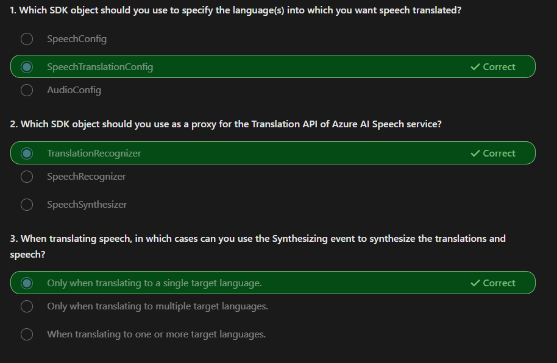

# Microsoft Certified: Azure AI Engineer Associate (AI-102) 

Design and implement an Azure AI solution using Azure AI services, Azure AI Search, and Azure Open AI.

- ### Microsoft Learn [link](https://learn.microsoft.com/en-us/credentials/certifications/azure-ai-engineer)

## [Get started with Azure AI Services](https://learn.microsoft.com/en-us/training/paths/get-started-azure-ai/)

- ### [Plan and prepare to develop AI solutions on Azure](https://learn.microsoft.com/en-us/training/modules/prepare-azure-ai-development/)

  - **Hubs**: A hub provides a centrally managed collection of shared resources and management configuration for AI solution development. You need at least one hub to use all of the solution development features and capabilities of AI Foundry. When you create a Azure AI Hub, four additional resources are created: A multi-service Azure AI Services, a KeyVault, a Storage Account and (optionally) an Azure AI Search.
  - **Projects**: A hub can support one or more projects, each of which is used to organize the resources and assets required for a particular AI development effort.
  - **Azure AI Developer** role: All permissions except create new hubs and manage the hub permissions.
  - **Azure AI Inference Deployment Operator** role : All permissions required to create a resource deployment within a resource group.
  - **Responsible AI**
    - Fairness
    - Reliability and safety
    - Privacy and security
    - Inclusiveness
    - Transparency
    - Accountability

- ### [Create and consume Azure AI services](https://learn.microsoft.com/en-us/training/modules/create-manage-ai-services/)

  - You can provision an AI services resource that supports multiple different AI services. For example, you could create a single resource that enables you to use the Azure AI Language, Azure AI Vision, Azure AI Speech, and other services.
  - To consume the service through the endpoint, applications require the following information:
    - **The endpoint URI**. This is the HTTP address at which the REST interface for the service can be accessed.
    - **A subscription key**. Access to the endpoint is restricted based on a subscription key. Client applications must provide a valid key to consume the service.
    - **The resource location**. When you provision a resource in Azure, you generally assign it to a location, which determines the Azure data center in which the resource is defined.
  - Azure AI services provide **REST** application programming interfaces (APIs) that client applications can use to consume services.

- ### [Secure Azure AI services](https://learn.microsoft.com/en-us/training/modules/secure-ai-services/)

  - **Regenerate keys**: You should regenerate keys regularly to protect against the risk of keys being shared with or accessed by unauthorized users. You can regenerate keys using the Azure portal, or using the az cognitiveservices account keys regenerate Azure command-line interface (CLI) command.
  - **Azure Key Vault**: Azure Key Vault is an Azure service in which you can securely store secrets (such as passwords and keys). Access to the key vault is granted to security principals, which you can think of user identities that are authenticated using Microsoft Entra ID. Administrators can assign a security principal to an application (in which case it is known as a service principal) to define a managed identity for the application.
  - Authenticate using service principals: Assign the _Cognitive Services Users_ role.
  - Authenticate using managed identities: We have two types, System-assigned managed identity and User-assigned managed identity, you give the _Cognitive Services Contributor_ role.
  - Configuring network access restrictions:
    - **Selected Networks and Private Endpoints**: Blocks connections to the resource, unless a rule allows access to it. These rules can be set for Azure virtual networks, IP addresses, CIDR, or Private Endpoints.
    - **Disabled**: Blocks all traffic to the resource. You can still add access to Private Endpoints. This is the most restrictive option.

- ### [Monitor Azure AI services](https://learn.microsoft.com/en-us/training/modules/monitor-ai-services/)

  - **Azure Event Hubs** allows you to forward the data on to a custom telemetry solution and connect directly to some third-party solutions. However, in most cases you'll use one (or both) of the following kinds of resource within your Azure subscription:
    - **Azure Log Analytics**: a service that enables you to query and visualize log data within the Azure portal.
    - **Azure Storage**: a cloud-based data store that you can use to store log archives.

- ### [Deploy Azure AI services in containers](https://learn.microsoft.com/en-us/training/modules/investigate-container-for-use-with-ai-services/)

  - Azure AI services container configuration: When you deploy an Azure AI services container image to a host, you must specify three settings.

    | Setting | Description                                                         |
    | ------- | ------------------------------------------------------------------- |
    | ApiKey  | Key from your deployed Azure AI service; used for billing           |
    | Billing | Endpoint URI from your deployed Azure AI service; used for billing. |
    | Eula    | Value of accept to state you accept the license for the container.  |

- ### [Use AI responsibly with Azure AI Content Safety](https://learn.microsoft.com/en-us/training/modules/responsible-content-safety/)

  - **Content Safety**: Azure AI Content Safety is a set of advanced content moderating features that can be incorporated into your applications and services. Azure AI Content Safety is available as a resource in the Azure portal. It is designed to be used in applications and services to protect against harmful user-generated and AI-generated content. Azure AI Content Safety is available as part of Azure AI Foundry.
  - Azure AI Content Safety classifies content into four categories:

    

  - **Prompt shields** is a unified API to identify and block jailbreak attacks from inputs to LLMs
  - **Groundedness** detection protects against inaccurate responses in AI-generated text by LLMs.

## [Create computer vision solutions with Azure AI Vision](https://learn.microsoft.com/training/paths/create-computer-vision-solutions-azure-ai/)

- ### [Analyze images](https://learn.microsoft.com/en-us/training/modules/analyze-images/)

  - **Azure AI Vision** service is designed to help you extract information from images
  - Use **Analyze Image** REST method or the SDK of C#/Python

    ```python
    from azure.ai.vision.imageanalysis import ImageAnalysisClient
    from azure.ai.vision.imageanalysis.models import VisualFeatures
    from azure.core.credentials import AzureKeyCredential

    client = ImageAnalysisClient(
        endpoint=os.environ["ENDPOINT"],
        credential=AzureKeyCredential(os.environ["KEY"])
    )

    result = client.analyze(
        image_url="<url>",
        visual_features=[VisualFeatures.CAPTION, VisualFeatures.READ],
        gender_neutral_caption=True,
        language="en",
    )
    ```

    - VisualFeatures.TAGS: Identifies tags about the image, including objects, scenery, setting, and actions
    - VisualFeatures.OBJECTS: Returns the bounding box for each detected object
    - VisualFeatures.CAPTION: Generates a caption of the image in natural language
    - VisualFeatures.DENSE_CAPTIONS: Generates more detailed captions for the objects detected
    - VisualFeatures.PEOPLE: Returns the bounding box for detected people
    - VisualFeatures.SMART_CROPS: Returns the bounding box of the specified aspect ratio for the area of interest
    - VisualFeatures.READ: Extracts readable text

  - Result of analyze images is a JSON

  ```json
  {
    "apim-request-id": "abcde-1234-5678-9012-f1g2h3i4j5k6",
    "modelVersion": "<version>",
    "denseCaptionsResult": {
      "values": [
        {
          "text": "a house in the woods",
          "confidence": 0.7055229544639587,
          "boundingBox": {
            "x": 0,
            "y": 0,
            "w": 640,
            "h": 640
          }
        },
        {
          "text": "a trailer with a door and windows",
          "confidence": 0.6675070524215698,
          "boundingBox": {
            "x": 214,
            "y": 434,
            "w": 154,
            "h": 108
          }
        }
      ]
    },
    "metadata": {
      "width": 640,
      "height": 640
    }
  }
  ```

- ### [Classify images](https://learn.microsoft.com/en-us/training/modules/classify-images/)

  - **Azure AI Custom Vision** service enables you to build your own computer vision models for image classification or object detection Creating an Azure AI Custom Vision solution involves two tasks:
    1. Use existing (labeled) images to train an Azure AI Custom Vision model.
    2. Create a client application that submits new images to your model to generate predictions.
  - To use the Azure AI Custom Vision service, you **must provision two kinds** of Azure resource:
    1. A training resource used to train your models. This can be an Azure AI services multi-service resource or an Azure AI Custom Vision (Training) resource.
    2. A prediction resource, used by client applications to get predictions from your model. This can be an Azure AI services multi-service resource or an Azure AI Custom Vision (Prediction) resource.

- ### [Detect objects in images](https://learn.microsoft.com/en-us/training/modules/detect-objects-images/)

  - The most significant difference between training an image classification model and training an object detection model is the labeling of the images with tags. While image classification requires one or more tags that apply to the whole image, object detection requires that each label consists of a tag and a region that defines the bounding box for each object in an image.

- ### [Detect, analyze, and recognize faces](https://learn.microsoft.com/en-us/training/modules/detect-analyze-recognize-faces/)

  - **Face** service offers more comprehensive facial analysis capabilities than the Azure AI Vision service.
  - To detect and analyze faces with the Azure AI Vision service, call the **Analyze Image** function (SDK or equivalent REST method), specifying **_People_** as one of the visual features to be returned.
  - To train a facial recognition model with the Face service:

    1. Create a **Person Group** that defines the set of individuals you want to identify (for example, employees).
    2. Add a **Person** to the **Person Group** for each individual you want to identify.
    3. Add detected faces from multiple images to each **person**, preferably in various poses. The IDs of these faces will no longer expire after 24 hours (so they're now referred to as _persisted faces_).
    4. Train the model.

       

- ### [Read Text in images and documents](https://learn.microsoft.com/en-us/training/modules/read-text-images-documents-with-computer-vision-service/)

  - **Image Analysis Optical character recognition (OCR)**: - Use this feature for general, unstructured documents with smaller amount of text, or images that contain text. - Results are returned immediately (synchronous) from a single API call. - Has functionality for analyzing images past extracting text, including object detection, describing or categorizing an image, generating smart-cropped thumbnails and more. - Examples include: street signs, handwritten notes, and store signs.
  - **Document Intelligence**: - Use this service to read small to large volumes of text from images and PDF documents. - This service uses context and structure of the document to improve accuracy. - The initial function call returns an asynchronous operation ID, which must be used in a subsequent call to retrieve the results. - Examples include: receipts, articles, and invoices.
    - If using the **REST API**, specify the feature as `read`: `https://<endpoint>/computervision/imageanalysis:analyze?features=read&...`

- ### [Analyze video](https://learn.microsoft.com/en-us/training/modules/analyze-video/)

  - The **Azure Video Indexer** service is designed to help you extract information from videos.
  - **Azure Video Indexer API**: `https://api.videoindexer.ai/Auth/<location>/Accounts/<accountId>/AccessToken`. You can then use your token to consume the REST API and automate video indexing tasks, creating projects, retrieving insights, and creating or deleting custom models. For example, a GET call to `https://api.videoindexer.ai/<location>/Accounts/<accountId>/Customization/CustomLogos/Logos/<logoId>?<accessToken>` REST endpoint returns the specified logo. In another example, you can send a GET request to `https://api.videoindexer.ai/<location>/Accounts/<accountId>/Videos?<accessToken>`, which returns details of videos in your account

## [Develop natural language processing solutions with Azure AI Services](https://learn.microsoft.com/en-us/training/paths/develop-language-solutions-azure-ai/)

- ### [Analyze text with Azure AI Language](https://learn.microsoft.com/en-us/training/modules/analyze-text-ai-language/)

  - **Azure AI Language** is designed to help you extract information from text.
  - **Language detection** - determining the language in which text is written.

    - Document size under 5,120 characters.
    - Limit per document is 1,000 items(IDs)
    - Example request body with a list of **documents**, containing a unique **id** and the **text** to be analyzed. **countryHint** improves the prediction performance:

    ```json
    {
    "kind": "LanguageDetection",
    "parameters": {
        "modelVersion": "latest"
    },
    "analysisInput":{
        "documents":[
              {
                "id": "1",
                "text": "Hello world",
                "countryHint": "US"
              },
              {
                "id": "2",
                "text": "Bonjour tout le monde"
              }
        ]
    }
    ```

    - If the text you provide cannot be parsed by the analyzer, the **(Unkownn)** will be returned as result ion the _name and ISO_, as well as **0** in _confidenceScore_

  - **Key phrase extraction** - identifying important words and phrases in the text that indicate the main points.

    - Document size under 5,120 characters.
    - Limit per document is 1,000 items(IDs)
    - Example REST request:

    ```json
    {
        "kind": "KeyPhraseExtraction",
        "parameters": {
            "modelVersion": "latest"
        },
        "analysisInput":{
            "documents":[
                {
                "id": "1",
                "language": "en",
                "text": "You must be the change you wish
                        to see in the world."
                },
                {
                "id": "2",
                "language": "en",
                "text": "The journey of a thousand miles
                        begins with a single step."
                }
            ]
        }
    }
    ```

  - **Sentiment analysis** - quantifying how positive or negative the text is.

    - Example REST request:

    ```json
    {
      "kind": "SentimentAnalysis",
      "parameters": {
        "modelVersion": "latest"
      },
      "analysisInput": {
        "documents": [
          {
            "id": "1",
            "language": "en",
            "text": "Good morning!"
          }
        ]
      }
    }
    ```

  - **Named entity recognition** - detecting references to entities, including people, locations, time periods, organizations, and more.
    - Entities are grouped into categories (e.g., Person, Location, DateTime, Organization, etc.)
  - Example REST request:

    ```json
    {
      "kind": "EntityRecognition",
      "parameters": {
        "modelVersion": "latest"
      },
      "analysisInput": {
        "documents": [
          {
            "id": "1",
            "language": "en",
            "text": "Joe went to London on Saturday"
          }
        ]
      }
    }
    ```

  - **Entity linking** - identifying specific entities by providing reference links to Wikipedia articles.

    - Entity linking can be used to disambiguate entities of the same name by referencing an article in a knowledge base.
    - Example REST request:

    ```json
    {
      "kind": "EntityLinking",
      "parameters": {
        "modelVersion": "latest"
      },
      "analysisInput": {
        "documents": [
          {
            "id": "1",
            "language": "en",
            "text": "I saw Venus shining in the sky"
          }
        ]
      }
    }
    ```

- ### [Create question answering solutions with Azure AI Language](https://learn.microsoft.com/en-us/training/modules/create-question-answer-solution-ai-language/)

  - Azure AI Language includes a _question answering capability_, which enables you to define a **knowledge base** of question and answer pairs that can be queried using natural language input. **Knowledge base** can be created from existing sources, including:
    - Web sites containing frequently asked question (FAQ) documentation.
    - Files containing structured text, such as brochures or user guides.
    - Built-in chit chat question and answer pairs that encapsulate common conversational exchanges.
  - Comparison between _question answering client_ and _language understanding_

    |                  | Question answering                                                                                   | Language understanding                                                                                               |
    | ---------------- | ---------------------------------------------------------------------------------------------------- | -------------------------------------------------------------------------------------------------------------------- |
    | Usage pattern    | User submits a question, expecting an answer                                                         | User submits an utterance, expecting an appropriate response or action                                               |
    | Query processing | Service uses natural language understanding to match the question to an answer in the knowledge base | Service uses natural language understanding to interpret the utterance, match it to an intent, and identify entities |
    | Response         | Response is a static answer to a known question                                                      | Response indicates the most likely intent and referenced entities                                                    |
    | Client logic     | Client application typically presents the answer to the user                                         | Client application is responsible for performing appropriate action based on the detected intent                     |

  - To consume the published knowledge base, you can use the REST interface. The minimal request body for the function contains a question, like this:

    ```json
    {
      "question": "What do I need to do to cancel a reservation?",
      "top": 2,
      "scoreThreshold": 20,
      "strictFilters": [
        {
          "name": "category",
          "value": "api"
        }
      ]
    }
    ```

  - **Active learning** enhances the ability to improve responses to user questions by considering different phrasings that convey the same meaning. It helps in continuously refining answers by evaluating various ways questions might be asked. This process is enabled by default.

- ### [Build a conversational language understanding model](https://learn.microsoft.com/en-us/training/modules/build-language-understanding-model/)

  - **Pre-configured features**: Summarization, Named entity recognition, Personally identifiable information (PII) detection, Key phrase extraction, Sentiment analysis, Language detection
  - **Personally identifiable information (PII)** detection helps identify, categorize, and redact sensitive information such as email addresses, home addresses, IP addresses, names, and protected health information. For instance, an email address like "<email@contoso.com>" in a query can be identified and redacted to protect privacy.
  - **Learned features** require you to label data, train, and deploy your model to make it available to use in your application. These features allow you to customize what information is predicted or extracted.
    - Conversational language understanding (CLU): CLU does require data to be tagged by the user to teach it how to predict intents and entities accurately.
    - Custom named entity recognition
    - Custom text classification
    - Question answering
  - **Authentication**: We MUST use the **Ocp-Apim-Subscription-Key** to the header of our request, to use the Azure AI Language
  - REST endpoint for conversational language understanding: `{ENDPOINT}/language/authoring/analyze-conversations/projects/{PROJECT-NAME}/deployments/{DEPLOYMENT-NAME}?api-version={API-VERSION}`
  - Query your model with REST API: `{ENDPOINT}/language/:analyze-text?api-version={API-VERSION}`. Within the body of that request, you must specify the `kind` parameter, which tells the service what type of language understanding you're requesting. (For CLU: `{ENDPOINT}/language/:analyze-conversations?api-version={API-VERSION}`)
  - **Utterances** are the phrases that a user might enter when interacting with an application that uses your language model.
  - An **intent** represents a task or action the user wants to perform, or more simply the meaning of an utterance. **None** intent requires no action.
    - Example:
      - Intent: **GetTime**
      - Utterance: "What time is it?"
  - **Entities** are used to add specific context to intents. For example, you might define a TurnOnDevice intent that can be applied to multiple devices, and use entities to define the different devices.

    | -                                         | Utterance    | Intent                                                                 | Entities |
    | ----------------------------------------- | ------------ | ---------------------------------------------------------------------- | -------- |
    | What is the time?                         | GetTime      | User submits an utterance, expecting an appropriate response or action |
    | What time is it in London?                | GetTime      | Location (London)                                                      |
    | What's the weather forecast for Paris?    | GetWeather   | Location (Paris)                                                       |
    | Will I need an umbrella tonight?          | GetWeather   | Time (tonight)                                                         |
    | What's the forecast for Seattle tomorrow? | GetWeather   | Location (Seattle), Time (tomorrow)                                    |
    | Turn the light on.                        | TurnOnDevice | Device (light)                                                         |
    | Switch on the fan.                        | TurnOnDevice | Device (fan)                                                           |

    - You can have up to five **prebuilt components per entity**. Using prebuilt model elements can significantly reduce the time it takes to develop a conversational language understanding solution.

- ### [Create a custom text classification solution](https://learn.microsoft.com/en-us/training/modules/custom-text-classification/)

  - Custom text classification falls into two types of projects
    - Single label classification
    - Multiple label classification - you can assign multiple classes to each file
      
    - **False positive** - model predicts x, but the file isn't labeled x.
    - **False negative** - model doesn't predict label x, but the file in fact is labeled x.
    - **Recall** - Of all the actual labels, how many were identified; the ratio of true positives to all that was labeled.
    - **Precision** - How many of the predicted labels are correct; the ratio of true positives to all identified positives.
    - **F1 Score** - A function of recall and precision, intended to provide a single score to maximize for a balance of each component.
    - How to build text classification projects:
      

- ### [Custom named entity recognition](https://learn.microsoft.com/en-us/training/modules/custom-name-entity-recognition/)

  - **Custom NER** is an Azure API service that looks at documents, identifies, and extracts user defined entities. These entities could be anything from names and addresses from bank statements to knowledge mining to improve search results.
  - Project limits:
    - Training - at least 10 files, and not more than 100,000
    - Deployments - 10 deployment names per project
    - APIs
      - Authoring - this API creates a project, trains, and deploys your model. Limited to 10 POST and 100 GET per minute
      - Analyze - this API does the work of actually extracting the entities; it requests a task and retrieves the results. Limited to 20 GET or POST
    - Projects - only 1 storage account per project, 500 projects per resource, and 50 trained models per project
    - Entities - each entity can be up to 500 characters. You can have up to 200 entity types.
  - **Labeling**, or tagging, your data correctly is an important part of the process to create a custom entity extraction model. (Consistency, Precision, Completeness )
  - Labels are stored in a JSON file, in your Storage Account.

- ### [Translate text with Azure AI Translator service](https://learn.microsoft.com/en-us/training/modules/translate-text-with-translator-service/)

  - **Azure AI Translator** provides a multilingual text translation API that you can use for:
    - Language detection.
    - One-to-many translation.
    - Script transliteration (converting text from its native script to an alternative script).
  - **Azure resource for Azure AI Translator**: single-service Azure AI Translator resource or **Text Analytics API** in a multi-service Azure AI Services resource.
  - **Language detection**: **Detect** function of the REST API - <https://api.cognitive.microsofttranslator.com/detect?api-version=3.0>

    ```bash
    curl -X POST "<https://api.cognitive.microsofttranslator.com/detect?api-version=3.0>" -H "Ocp-Apim-Subscription-Region: <your-service-region>" -H "Ocp-Apim-Subscription-Key: <your-key>" -H "Content-Type: application/json" -d "[{ 'Text' : 'こんにちは' }]
    ```

- **Translation**: **Translate** function specifying a **_from_** parameter and **_to_** parameters with the values you want.

  ```bash
  curl -X POST "https://api.cognitive.microsofttranslator.com/translate?api-version=3.0&from=ja&to=fr&to=en" -H "Ocp-Apim-Subscription-Key: <your-key>" -H "Ocp-Apim-Subscription-Region: <your-service-region>" -H "Content-Type: application/json; charset=UTF-8" -d "[{ 'Text' : 'こんにちは' }]"
  ```

- **Transliteration**: **Transliterate** function with a **_fromScript_** parameter and a **_toScript_** parameter.

  ```bash
  curl -X POST "https://api.cognitive.microsofttranslator.com/transliterate?api-version=3.0&fromScript=Jpan&toScript=Latn" -H "Ocp-Apim-Subscription-Key: <your-key>" -H "Ocp-Apim-Subscription-Region: <your-service-region>" -H "Content-Type: application/json" -d "[{ 'Text' : 'こんにちは' }]"
  ```

- **Word alignment**: In written English (using Latin script), spaces are used to separate words. However, in some other languages (and more specifically, scripts) this is not always the case. For example, translating "Smart Services" from en (English) to zh (Simplified Chinese) produces the result "智能服务", and it's difficult to understand the relationship between the characters in the source text and the corresponding characters in the translation. To resolve this problem, you can specify the **includeAlignment** parameter with a value of **true** in your call
- **Sentence length**: Sometimes it might be useful to know the length of a translation, for example to determine how best to display it in a user interface. You can get this information by setting the **includeSentenceLength** parameter to **true**.
- **Profanity filtering**: Sometimes text contains profanities, which you might want to obscure or omit altogether in a translation. You can handle profanities by specifying the **profanityAction** parameter, which can have one of the following values:

  - **NoAction**: Profanities are translated along with the rest of the text.
  - **Deleted**: Profanities are omitted in the translation.
  - **Marked**: Profanities are indicated using the technique indicated in the **profanityMarker** parameter (if supplied). The default value for this parameter is - **Asterisk**, which replaces characters in profanities with "\*". As an alternative, you can specify a **profanityMarker** value of **Tag**, which causes profanities to be enclosed in XML tags.

- ### [Create speech-enabled apps with Azure AI services](https://learn.microsoft.com/en-us/training/modules/create-speech-enabled-apps/)

  - **Azure AI Speech** provides APIs that you can use to build speech-enabled applications. It requires the **location** and one of the **keys** of the resource to work. This includes:
    - **Speech to Text**: Converts spoken input into text.
    - **Text to Speech**: Converts text into spoken output.
    - **Speech Translation**: Translates spoken input into multiple languages.
    - **Speaker Recognition**: Identifies individual speakers based on their voice.
    - **Intent Recognition**: Determines the semantic meaning of spoken input using conversational language understanding.
    - The **Speech to text Short Audio API**, which is optimized for short streams of audio (up to 60 seconds).
    - **Speech to Text**
      
    - The **Batch synthesis API**, which is designed to support batch operations that convert large volumes of text to audio.
    - **Text to Speech**
      
    - Supported **Audio Format** (use _SetSpeechSynthesisOutputFormat_ in the SDK):
      - Audio file type
      - Sample-rate
      - Bit-depth
    - Supported **Voices** (use _SpeechSynthesisVoiceName_ in the SDK):
      - Standard voices - synthetic voices created from audio samples.
      - Neural voices - more natural sounding voices created using deep neural networks.
    - **Speech Synthesis Markup Language**: a service with an XML-based syntax for describing characteristics of the speech you want to generate. The method of the SDK is **SpeakSsmlAsync()**

- ### [Translate speech with the Azure AI Speech service](https://learn.microsoft.com/en-us/training/modules/translate-speech-speech-service/)

  - **Translate speech to text**
    
  - **Synthesize translations**: Two methods to accomplish this:
    - **Event-based synthesis**: When you want to perform 1:1 translation (translating from one source language into a single target language).
    - **Manual synthesis**: Manual synthesis is an alternative approach to event-based synthesis that doesn't require you to implement an event handler. You can use manual synthesis to generate audio translations for one or more target languages.
      

## [Implement knowledge mining with Azure AI Search](https://learn.microsoft.com/en-us/training/paths/implement-knowledge-mining-azure-cognitive-search/)

- ### [Create an Azure AI Search solution](https://learn.microsoft.com/en-us/training/modules/create-azure-cognitive-search-solution/)

  - **Azure AI Search**: Azure AI Search provides a cloud-based solution for indexing and querying a wide range of data sources, and creating comprehensive and high-scale search solutions. With Azure AI Search, you can:
    - Index documents and data from a range of sources.
    - Use cognitive skills to enrich index data.
    - Store extracted insights in a knowledge store for analysis and integration.
  - **Service tiers**:
    - **Free (F)**: Best for exploring the service or running tutorials.
    - **Basic (B)**: For small-scale solutions — up to 15 indexes and 5 GB of index data.
    - **Standard (S)**: For enterprise-scale solutions — variants (S, S2, S3) offer increasing capacity; **S3HD** focuses on fast reads with fewer indexes.
    - **Storage Optimized (L)**: For large indexes — **L1** and **L2** tiers — designed for heavy storage needs but with higher query latency
  - **Replicas**: Instances of the search service (like nodes). More replicas = better handling of concurrent queries and indexing.
  - **Partitions**: Split an index across multiple storage locations. More partitions = improved I/O performance for queries and index rebuilds.
  - Here’s a neat summary of what you’ve shared:
  - **Data Source**  
    The origin of your searchable data. Supported types include:

    - Unstructured files in **Azure Blob Storage**
    - Tables in **Azure SQL Database**
    - Documents in **Cosmos DB**
    - Or, **JSON data** pushed directly into the index.

  - **Skillset**  
    Defines AI-powered enrichment steps for your data before indexing. AI skills can extract:

    - Language detection
    - Key phrases and sentiment
    - Named entities (people, locations, organizations, etc.)
    - Image insights (descriptions, OCR text)
    - Custom AI logic

  - **Indexer**  
    Automates the process of:

    - Pulling data from the source.
    - Applying the **skillset**.
    - Mapping the output to **index fields**.
    - Can run on schedule or on-demand.

  - **Index**  
    The final, searchable structure — a collection of JSON documents with fields like:

    - `key` (unique identifier)
    - `searchable` (enables text search)
    - `filterable` (enables filtering results)
    - `sortable` (enables sorting)
    - `facetable` (supports UI facets for filtering)
    - `retrievable` (defines if the field is returned in queries)
    - Sure! Here’s your content rewritten as a clean, icon-free **Markdown note**:

  - **Indexing Process**: The indexing process creates a document for each entity in the data source. An enrichment pipeline is used to build these documents by combining metadata from the source with enriched fields extracted by cognitive skills.

    - Initial Document Structure: At the beginning, the document contains fields directly mapped from the data source:

      ```bash
      document
      ├─ metadata_storage_name
      ├─ metadata_author
      └─ content
      ```

    - **Handling Images**: If the data source contains images, the indexer can extract them and place them into a `normalized_images` collection:

      ```bash
      document
      ├─ metadata_storage_name
      ├─ metadata_author
      ├─ content
      └─ normalized_images
          ├─ image0
          └─ image1
      ```

    - **Skill Application**: Each cognitive skill adds new fields to the document. For example, a language detection skill might add:

      ```bash
      document
      ├─ metadata_storage_name
      ├─ metadata_author
      ├─ content
      ├─ normalized_images
      │   ├─ image0
      │   └─ image1
      └─ language
      ```

      If using an OCR skill on the images, the structure becomes:

      ```bash
      document
      ├─ metadata_storage_name
      ├─ metadata_author
      ├─ content
      ├─ normalized_images
      │   ├─ image0
      │   │   └─ Text
      │   └─ image1
      │       └─ Text
      └─ language
      ```

    - **Chaining Skills**: Skill outputs can be reused as inputs for other skills. For example, a merge skill could combine original text and image text:

      ```bash
      document
      ├─ metadata_storage_name
      ├─ metadata_author
      ├─ content
      ├─ normalized_images
      │   ├─ image0
      │   │   └─ Text
      │   └─ image1
      │       └─ Text
      ├─ language
      └─ merged_content
      ```

    - **Mapping Fields to the Index**: At the end of the enrichment process, fields are mapped to index fields:
      - Fields from the data source:
        - Implicit mapping (automatic, same-name fields).
        - Explicit mapping (manual mapping or renaming).
      - Fields generated by cognitive skills:
        - Explicit mapping from their position in the document to the target index field.
    - **Full text search**: Full text search describes search solutions that parse text-based document contents to find query terms. Full text search queries in Azure AI Search are based on the Lucene query syntax
      - **Common Query Parameters:**
        - `search`: Terms to search for.
        - `queryType`: Choose between Simple or Full syntax.
        - `searchFields`: Specific fields to search in.
        - `select`: Fields to return in results.
        - `searchMode`:
          - `Any`: Returns documents matching any term.
          - `All`: Returns only documents containing all terms.
    - **Query Processing Stages:**
      1. Query parsing — Breaks down the search expression into subqueries (terms, phrases, prefixes).
      2. Lexical analysis — Normalizes terms: lowercasing, removing stopwords, stemming, and tokenizing.
      3. Document retrieval — Matches the processed query terms against indexed documents.
      4. Scoring — Calculates relevance based on TF/IDF (Term Frequency / Inverse Document Frequency).

  - **Filtering & Sorting**:

    - **Filtering**  
       You can refine results by:

      - Simple Search: `search=London+author='Reviewer' queryType=Simple`
      - OData Filter:  
         `search=London`  
         `$filter=author eq 'Reviewer'`
        `queryType=Full`  
         _(OData filters are case-sensitive!)_

    - **Facets**  
       Facets show available filter options to users.  
       Example:  
       `search=*`  
       `facet=author`  
       → UI shows available `author` values to filter.

    - **Sorting**  
       Default = by **relevance score**.  
       Custom order:  
       `$orderby=last_modified desc`  
       _(descending by last modified date)_
      Absolutely — here’s a clear, minimal and student-friendly summary for your notes:

  - **Enhancing Azure AI Search Index**

    - **Search-as-you-type**  
      → Add a `suggester` to enable:  
      `Suggestions` (results list while typing)  
      `Autocomplete` (auto-complete terms).

    - **Custom Scoring & Boosting**  
      → Use `Scoring Profiles` to:  
      Prioritize results from specific fields or boost by field values (e.g. last modified, size).

    - **Synonyms**  
      → Define `Synonym Maps` so searches return related terms.  
      Example: `"UK"` ↔ `"United Kingdom"` ↔ `"Great Britain"`.

- ### [Create a custom skill for Azure AI Search](https://learn.microsoft.com/en-us/training/modules/create-azure-ai-custom-skill/)

  - **Input Schema**: Structure: JSON with records.
    - Components:
      recordId: Unique ID.
      data: Inputs.
  - **Output Schema**: Structure: JSON reflecting input. The output value can contain any JSON structure, accommodating complex types.
    - Components:
      recordId: Matches input ID.
      data: Results.
      errors: List of errors.
      warnings: List of warnings
  - **Adding a Custom Skill**

    - Skill Definition:

      - URI: Web API endpoint.
      - Context: Where to apply the skill.
      - Inputs: From document fields.
      - Outputs: New field for results.

      - Example

        ```json
        {
          "skills": [
            {
              "@odata.type": "#Microsoft.Skills.Custom.WebApiSkill",
              "description": "<custom skill description>",
              "uri": "https://<web_api_endpoint>?<params>",
              "httpHeaders": {
                "<header_name>": "<header_value>"
              },
              "context": "/document/<where_to_apply_skill>",
              "inputs": [
                {
                  "name": "<input1_name>",
                  "source": "/document/<path_to_input_field>"
                }
              ],
              "outputs": [
                {
                  "name": "<output1_name>",
                  "targetName": "<optional_field_name>"
                }
              ]
            }
          ]
        }
        ```

  - **Custom text classification skill**
    

- ### [Create a knowledge store with Azure AI Search](https://learn.microsoft.com/en-us/training/modules/create-knowledge-store-azure-cognitive-search/)

  - **Knowledge stores**: A knowledge store in Azure AI Search allows you to persist enriched data from your indexing pipeline for various uses:
    - Index: Collection of JSON objects representing indexed records.
    - Knowledge Store: Stores projections of enriched data as JSON objects, tables, or image files. To define the knowledge store and the projections you want to create in it, you must create a _knowledgeStore_ object in the skillset that specifies the _Azure Storage connection string_ for the storage account where you want to create projections, and the definitions of the projections themselves.
  - **Projections**
    - **Projections**: Data fields that are stored in a knowledge store, based on document structures generated by the enrichment pipeline during indexing.
    - **Incremental Document Building**: Each skill in the skillset iteratively builds a JSON representation of enriched data for documents being indexed.
  - **Shaper Skill**
    - **Purpose**: Simplifies complex schema generated during indexing by creating a new field containing a simpler structure for fields to be mapped to projections.
    - **Usage**: Commonly used to map field values to projections in a knowledge store.

- ### [Implement advanced search features in Azure AI Search](https://learn.microsoft.com/en-us/training/modules/implement-advanced-search-features-azure-cognitive-search/)

  - **Search an Index**
    

  - **Term boosting**: `^` for example Description:luxury OR Category:luxury^3 would give hotels with the category luxury a higher score than luxury in the description.
  - Azure AI Search uses the **BM25 similarity ranking algorithm**. The algorithm scores documents based on the search terms used.
  - **Scoring functions**
    
  - **Analyzers in AI Search**

    - **Purpose of Analyzers**:
      - Process text to build a useful index for search.
      - Tasks include breaking text into words, removing stopwords, and reducing words to their root form.
    - **Default Analyzer**:
      - If unspecified, the default Lucene analyzer is used.
      - Suitable for most fields and supports many languages.
    - **Types of Built-in Analyzers**:
      1. **Language Analyzers:**
         - For advanced language-specific capabilities.
         - Microsoft provides 50 language-specific analyzers.
      2. **Specialized Analyzers:**
         - Language-agnostic, used for fields like zip codes or product IDs.
         - Example: PatternAnalyzer for matching token separators using regular expressions.
    - **Custom Analyzers**:
      - Created when built-in analyzers do not meet specific needs.
      - Components of a custom analyzer:
        1. **Character Filters:**
           - Pre-process text before tokenization.
           - Types: `html_strip`, `mapping`, `pattern_replace`.
        2. **Tokenizers:**
           - Divide text into tokens.
           - Types: `classic`, `keyword`, `lowercase`, `microsoft_language_tokenizer`, `pattern`, `whitespace`.
        3. **Token Filters:**
           - Further process tokens (e.g., remove stopwords, trim punctuation).
           - Types: `arabic_normalization`, `apostrophe`, `classic`, `keep`, `length`, `trim`.
    - **Creating a Custom Analyzer**:

      - Define using JSON code.
      - Include in the `analyzers` section during index design.
      - Example structure:

        ```json
        "analyzers": [
            {
                "name": "ContosoAnalyzer",
                "@odata.type": "#Microsoft.Azure.Search.CustomAnalyzer",
                "charFilters": ["WebContentRemover"],
                "tokenizer": "IcelandicTokenizer",
                "tokenFilters": ["ApostropheFilter"]
            }
        ],
        "charFilters": [
            {
                "name": "WebContentRemover",
                "@odata.type": "#html_strip"
            }
        ],
        "tokenizers": [
            {
                "name": "IcelandicTokenizer",
                "@odata.type": "#microsoft_language_tokenizer",
                "language": "icelandic",
                "isSearchTokenizer": false
            }
        ],
        "tokenFilters": [
            {
                "name": "ApostropheFilter",
                "@odata.type": "#apostrophe"
            }
        ]
        ```

    - **Testing a Custom Analyzer**:

      - Use REST API’s Analyze Text function.
      - Example REST request:

        ```http
        POST https://<search service name>.search.windows.net/indexes/<index name>/analyze?api-version=<api-version>
        Content-Type: application/json
        api-key: <api key>
        ```

      - JSON body:

        ```json
        {
          "text": "Test text to analyze.",
          "analyzer": "<analyzer name>"
        }
        ```

    - **Using a Custom Analyzer for a Field**:

      - Configure in the index definition.
      - Example for using the same analyzer for indexing and searching:

        ```json
        "fields": [
            {
                "name": "IcelandicDescription",
                "type": "Edm.String",
                "retrievable": true,
                "searchable": true,
                "analyzer": "ContosoAnalyzer",
                "indexAnalyzer": null,
                "searchAnalyzer": null
            }
        ]
        ```

      - Example for using different analyzers for indexing and searching:

        ```json
        "fields": [
            {
                "name": "IcelandicDescription",
                "type": "Edm.String",
                "retrievable": true,
                "searchable": true,
                "analyzer": null,
                "indexAnalyzer": "ContosoIndexAnalyzer",
                "searchAnalyzer": "ContosoSearchAnalyzer"
            }
        ]
        ```

  - **Geo-Spatial Search**: Search for items associated with a geographical location. For example, they might want to find the nearest coffee shop to their location. To help you compare locations on the Earth's surface, AI Search includes geo-spatial functions that you can call in queries.
    - **geo.distance**. This function returns the distance in a straight line across the Earth's surface from the point you specify to the location of the search result. Returns the distance between them in kilometers.
      - `search=(Description:luxury OR Category:luxury)$filter=geo.distance(location, geography'POINT(-122.131577 47.678581)') le 5&$select=HotelId, HotelName, Category, Tags, Description&$count=tru` - This query returns all the luxury hotels in the index within five kilometers of the Eiffel Tower.
    - **geo.intersects**. This function returns true if the location of a search result is inside a polygon that you specify.
    - To use these functions, make sure that your index includes the location for results. Location fields should have the datatype Edm.GeographyPoint and store the latitude and longitude.
      - `search=(Description:luxury OR Category:luxury) AND geo.intersects(Location, geography'POLYGON((2.32 48.91, 2.27 48.91, 2.27 48.60, 2.32 48.60, 2.32 48.91))')&$select=HotelId, HotelName, Category, Tags, Description&$count=true` - This query returns all luxury hotels within a square around the Eiffel Tower
     

- ### [Search data outside the Azure platform in Azure AI Search using Azure Data Factory](https://learn.microsoft.com/en-us/training/modules/search-data-outside-azure-platform-cognitive-search/)

  - **Azure Data Factory (ADF) Pipeline → Azure AI Search Index**:
      1. Create an Azure AI Search **index** (define fields).  
      2. Create an ADF **pipeline** with a **Copy Data** step.  
      3. Set **Source** (data location).  
      4. Set **Sink** (search index).  
      5. **Map fields** from source → index.  
      6. **Run the pipeline** to load data.
  - **Azure AI Search data type**
    - String
    - Int32
    - Int64
    - Double
    - Boolean
    - DataTimeOffset
  

- ### [Maintain an Azure AI Search solution](https://learn.microsoft.com/en-us/training/modules/maintain-azure-cognitive-search-solution/)

  - **Data encryption**: Data in transit is encrypted using the standard _HTTPS TLS 1.3 encryption over port 443_.
  - **Secure inbound traffic**:
    
  - The default option when you create your ACS is **key-based authentication**. There are two different kinds of keys:
    - **Admin keys** - grant your write permissions and the right to query system information (maximum of 2 admin keys can be created per search service)
    - **Query keys** - grant read permissions and are used by your users or apps to query indexes (maximum of 50 query keys can be created per search service)
  - **Source specific Role-based access control (RBAc)**:
    1. **Search Service Contributor** - A role for your search service administrators (the same access as the Contributor role above) and the content (indexes, indexers, data sources, and skillsets).
    2. **Search Index Data Contributor** - A role for developers or index owners who will import, refresh, or query the documents collection of an index.
    3. **Search Index Data Reader** - Read-only access role for apps and users who only need to run queries
  - **Search throttled** : 503 HTTP Response
  - **Index throttled** : 207 HTTP Response
  - T**ips to reduce the cost of your search solution**:
    - Same Region → Keep resources in one region to lower bandwidth costs
    - Scale Smart → Scale up during indexing, scale down for regular queries
    - Azure Web App → Use as front-end to avoid external traffic costs
    - Enrichment Caching → Enable if using AI enrichment on blobs.
  

- ### [Perform search reranking with semantic ranking in Azure AI Search](https://learn.microsoft.com/en-us/training/modules/use-semantic-search/)

  - **Semantic ranking**: Semantic ranking is a capability within Azure AI Search that aims to improve the ranking of search results. Semantic ranking improves the ranking of search results by using language understanding to more accurately match the context of the original query.
  - **BM25 ranking function**: By default, Azure AI Search uses the BM25 ranking function, which scores results based on term frequency — the more a term appears, the higher the rank. While effective for many cases, BM25 ignores query semantics, so using Semantic Ranking can further improve relevance by understanding context, not just keywords.
  - **Semantic captions**: extract summary sentences from the document verbatim and highlight the most relevant text in the summary sentences.
  - **How Semantic Ranking Works**:
    - **Step 1:** Takes the top **50 BM25-ranked results**.  
    - **Step 2:** Splits results into fields, converts to text, trims to **256 unique tokens**.  
    - **Step 3:** Uses **Machine Reading Comprehension (MRC) models** to extract the most relevant phrases (semantic captions) and, optionally, direct answers.  
    - **Step 4:** Reranks results based on **semantic relevance**, not just keyword matching.
  - **Pricing**: Up to 1000 semantic ranking queries a month free.

- ### [Perform vector search and retrieval in Azure AI Search](https://learn.microsoft.com/en-us/training/modules/improve-search-results-vector-search/)

  - **Vector search**: Vector search is a capability available in AI Search used to index, store and retrieve vector embedding from a search index. You can use it to power applications implementing the Retrieval Augmented Generation (RAG) architecture, similarity and multi-modal searches or recommendation engines.
