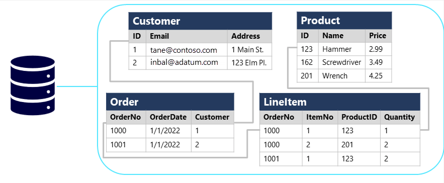
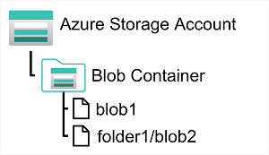

# Microsoft Certified: Azure Data Fundamentals (DP-900)

Demonstrate foundational knowledge of core data concepts related to Microsoft Azure data services.

- ### Microsoft Learn [link](https://learn.microsoft.com/en-us/credentials/certifications/azure-data-fundamentals/?practice-assessment-type=certification)

## [Microsoft Azure Data Fundamentals: Explore core data concepts](https://learn.microsoft.com/en-us/training/paths/azure-data-fundamentals-explore-core-data-concepts/)

- ### [Explore core data concepts](https://learn.microsoft.com/en-us/training/modules/explore-core-data-concepts/)

  - **Types of Data**

    1. Structured Data

        - Adheres to a fixed schema.
        - Organized in tabular format (rows = entity instances, columns = attributes).
        - Commonly stored in relational databases using key values to link tables.
          **Example Table:**

              | CustomerID | Name  | Email          |
              |------------|-------|----------------|
              | 1          | Joe   | <joe@email.com>  |

    2. Semi-Structured Data

        - Has some structure but allows variation between entities.
        - JSON is a common format.
        - Fields can differ between records.

        **Example JSON:**

        ```json
        {
          "firstName": "Joe",
          "contact": [{ "type": "email", "address": "joe@litware.com" }]
        }
        ```

        - Common types: HTML, YAML, JSON, XML

    3. Unstructured Data
        - No predefined format or schema.
        - Examples: text documents, images, audio files, videos, binary data.
        - More complex to store, query, and analyze.
        - Common Types: .doc, .docx, .pdf, .txt

  - **Data Stores**
    - **File Stores**: Store unstructured and semi-structured data (e.g., documents, media files).
    - **Databases**: Store structured data (and some semi-structured data in modern systems).
  - **Data Formats**: CSV, TSV, JSON, XML, Binary Large Object (BLOB)
  - **BLOB Containers**: Azure Containers that stores types as binary like images, audios, videos, and application-specific documents.
  - **Parquet**: Columnar data format, it organizes data into row groups and uses column-wise storage, allowing fast reads and selective access to specific columns.
  - **Database**: A database is used to define a central system in which data can be stored and queried.
  - **Types of databases:**
    - **Relational Databases**
      - Store and query structured data.
      - Data organized in tables representing entities (e.g., customers, products).
      - Use primary keys to uniquely identify entity instances.
      - Keys reference entities in other tables for normalization (eliminate duplicate data).
      - Managed and queried using SQL (ANSI standard).
      - **Example:**
        - Customer's primary key referenced in sales order records.
      - **Diagram:**
        
    - **Non-Relational Databases**
      - Do not use a relational schema (often called NoSQL databases).
      - **Types:**
        1. **Key-Value Databases**
           - Each record: unique key + associated value (any format).
           - **Diagram:** 
        2. **Document Databases**
           - Form of key-value where value is a JSON document.
           - Optimized for parsing and querying.
           - **Diagram:** 
        3. **Column Family Databases**
           - Tabular data with rows and columns.
           - Columns divided into column-families (logically related).
           - **Diagram:** 
        4. **Graph Databases**
           - Store entities as nodes with links to define relationships.
           - **Diagram:** 
  - **Transactional Data Processing**

    - Records transactions as discrete units of work.
    - Examples: financial transactions, retail payments.
    - High-volume, fast access required.
    - Known as Online Transactional Processing (OLTP).

  - **OLTP Solutions**
    - Use databases optimized for read/write operations.
    - Support CRUD operations: Create, Retrieve, Update, Delete.
    - Ensure data integrity with ACID properties:
      1. **Atomicity**
         - Transactions succeed or fail completely.
         - Example: Debit and credit actions in a fund transfer.
      2. **Consistency**
         - Transactions move data between valid states.
         - Example: Reflect correct fund transfer.
      3. **Isolation**
         - Concurrent transactions remain consistent.
         - Example: Balance checks return consistent results.
      4. **Durability**
         - Committed transactions persist even after system restart.
    - Used for live applications (Line of Business - LOB).
  - **Analytical Data Processing (OLAP)**
    - Focuses on read-only systems for historical data or business metrics.
    - Uses snapshots or series of snapshots for analysis.
    - **Diagram:** 
  - **Common Architecture**
    1. **ETL Process**
       - Extract, Transform, Load operational data into data lakes.
    2. **Data Storage**
       - Spark-based data lakehouse or data warehouse (relational SQL engine).
    3. **OLAP Models**
       - Aggregated data storage for analytical workloads.
       - Aggregations across dimensions (e.g., sales by date, customer, product).
    4. **Data Querying**
       - Produce reports, visualizations, dashboards.
  - **Data Storage Options**
    - **Data Lakes**
      - Large-scale scenarios, file-based data collection.
    - **Data Warehouses**
      - Relational schema optimized for read operations.
    - **Data Lakehouses**
      - Combines data lake flexibility with warehouse querying.
  - **OLAP Models**
    - Pre-aggregated data for fast querying.
    - Drill up/down across dimensions (e.g., sales by region).

- ### [Explore data roles and services](https://learn.microsoft.com/en-us/training/modules/explore-roles-responsibilities-world-of-data/)

  - **Key Job Roles**:

    1. **Database Administrator**

       - Manages database design, implementation, and maintenance.
       - Ensures availability, performance, and optimization.
       - Implements backup/recovery plans.
       - Manages data security and user access.
       - **Responsibilities:** On-premises/cloud databases, disaster recovery.

    2. **Data Engineer**

       - Designs and implements data workloads and pipelines.
       - Handles data ingestion, cleansing, and transformation.
       - Uses relational/non-relational databases, file stores, and data streams.
       - Ensures data privacy and monitors data pipelines.
       - **Responsibilities:** Data integration, cloud/on-premises data management.

    3. **Data Analyst**
       - Explores data to identify trends and relationships.
       - Builds analytical models and visualizations.
       - Processes raw data into business insights.
       - **Responsibilities:** Maximize data value, deliver insights.

  - **Hybrid Roles**: Perform tasks across multiple roles.

  1. **Azure SQL**

     - Family of relational database solutions.
     - **Services:**
       - Azure SQL Database (PaaS)
       - Azure SQL Managed Instance
       - Azure SQL VM
     - Supports LOB applications, ETL pipelines, and reporting.

  2. **Open-source Databases in Azure**

     - Managed services for popular open-source databases.
     - **Services:**
       - Azure Database for MySQL
       - Azure Database for MariaDB
       - Azure Database for PostgreSQL
     - Supports transactional applications, data pipelines, and reports.

  3. **Azure Cosmos DB**

     - Global-scale NoSQL database.
     - Supports JSON documents, key-value pairs, column-families, graphs.
     - Integrated into enterprise analytics.

  4. **Azure Storage**

     - Core service for storing data.
     - **Types:**
       - Blob containers
       - File shares
       - Tables
     - Used for data lakes and distributed file systems.

  5. **Azure Data Factory**

     - Defines and schedules data pipelines.
     - Integrates with other Azure services for ETL solutions.

  6. **Microsoft Fabric**

     - Unified SaaS analytics platform.
     - Supports data ingestion, ETL, lakehouse, warehouse analytics, real-time analytics, BI, AI insights.

  7. **Azure Databricks**

     - Combines Apache Spark with SQL semantics.
     - Large-scale data analytics and visualization.

  8. **Azure Stream Analytics**

     - Real-time stream processing engine.
     - Captures and processes streaming data.

  9. **Azure Data Explorer**

     - Standalone big data analytics platform.
     - High-performance querying of log/telemetry data.

  10. **Microsoft Purview**
      - Enterprise-wide data governance and discoverability.
      - Tracks data lineage and ensures data integrity.

## [Microsoft Azure Data Fundamentals: Explore relational data in Azure](https://learn.microsoft.com/en-us/training/paths/azure-data-fundamentals-explore-relational-data/)

- ### [Explore fundamental relational data concepts](https://learn.microsoft.com/en-us/training/modules/explore-relational-data-offerings/)

  - **Data Types in Tables**: Columns store specific datatypes. Datatype definitions depend on the database system but follow ANSI standards.
  - **Examples:**
    - Email column: character-based (text) data.
    - Price column: decimal numeric data.
    - Quantity column: integer numeric values.
    - OrderDate column: date/time values.
  - **Normalization**
    - Minimizes data duplication and enforces data integrity.
    - Key principles:
      1. Separate each entity into its own table.
      2. Separate discrete attributes into own columns.
      3. Use primary keys for unique identification.
      4. Use foreign keys to link related entities.
  - **Normalization Process**
    
    
    - **Example:**
      - Un-normalized table duplicates customer/product details.
      - Normalized schema stores entities in separate tables.
      - Attributes are divided into individual columns.
  - **Benefits of Normalization**
    - Reduces data duplication (e.g., changing customer address in one place).
    - Ensures appropriate data types for columns.
    - Provides granularity for querying (e.g., filter customers by city).
    - Enforces referential integrity with primary and foreign keys.
    - Supports composite keys for unique identification across multiple columns.
  - **SQL Overview**
    - Structured Query Language for relational databases.
    - Common RDBMS using SQL: Microsoft SQL Server, MySQL, PostgreSQL, MariaDB, Oracle.
  - **SQL Dialects**
    - Transact-SQL (T-SQL): Microsoft SQL Server, Azure SQL.
    - pgSQL: PostgreSQL.
    - PL/SQL: Oracle.
  - **SQL Statement Types**

    1. **Data Definition Language (DDL)**

       - CREATE, ALTER, DROP, RENAME.
       - When you DROP a table, all the rows in that table are lost!
       - Example: `CREATE TABLE Product(ID INT PRIMARY KEY, Name VARCHAR(20) NOT NULL, Price DECIMAL NULL);`
       - Columns marked as **NOT NULL** are referred to as _mandatory_ columns.

    2. **Data Control Language (DCL)**

       - GRANT, DENY, REVOKE.
       - Example: `GRANT SELECT, INSERT, UPDATE ON Product TO user1;`

    3. **Data Manipulation Language (DML)**
       - SELECT, INSERT, UPDATE, DELETE.
       - Examples:
         - SELECT: `SELECT * FROM Customer WHERE City = 'Seattle';`
         - INSERT: `INSERT INTO Product(ID, Name, Price) VALUES (99, 'Drill', 4.99);`
         - UPDATE: `UPDATE Customer SET Address = '123 High St.' WHERE ID = 1;`
         - DELETE: `DELETE FROM Product WHERE ID = 162;`

  - **SQL Best Practices**
    - Use _WHERE_ clause to prevent unintended data modifications/deletions.
    - _JOIN_ for querying multiple tables based on relationships.
  - **Database Objects Overview**

    1. **Views**

       - Virtual tables from SELECT queries.
       - Simplify complex queries by encapsulating them.
       - Example: View combining Order and Customer for delivery info.
       - Querying views similar to tables.

    2. **Stored Procedures**

       - Encapsulate SQL statements for reuse.
       - Support parameters for flexibility.
       - Used for programmatic logic in databases.
       - Example: Procedure to rename a product by ID.

    3. **Indexes**
       - Improve search speed in tables.
       - Similar to a book index, sorted with references.
       - Example: Index on Product table's Name column.
       - Trade-off: Faster queries vs. slower data modifications due to maintenance.
       - Multiple indexes can be created per table for different columns.

  - **Performance Considerations**
    - Use indexes judiciously to balance query performance and data modification efficiency.

- ### [Explore relational database services in Azure](https://learn.microsoft.com/en-us/training/modules/explore-provision-deploy-relational-database-offerings-azure/)

  - **Azure SQL Services**
    

    1. **SQL Server on Azure VMs**

       - **Type:** IaaS
       - **Compatibility:** Full "lift and shift" for existing on-prem SQL Server.
       - **Architecture:** SQL Server in Azure VM, supports multiple databases.
       - **Management:** Full control over server and database configuration.
       - **Use Cases:** Migrate/extend on-prem solutions with control over OS features.

    2. **Azure SQL Managed Instance**

       - **Type:** PaaS
       - **Compatibility:** Near-100% with SQL Server, minimal migration changes.
       - **Architecture:** Multiple databases per instance, automated maintenance.
       - **Management:** Simplified administrative tasks, control over security/resources.
       - **Use Cases:** Cloud migration with minimal changes, use of advanced SQL features.

    3. **Azure SQL Database**
       - **Type:** PaaS
       - **Compatibility:** Core SQL Server capabilities, some limitations.
       - **Architecture:** Single Database or Elastic Pool for resource sharing.
       - **Management:** Automated updates, high availability.
       - **Use Cases:** New cloud projects, modern applications needing scalability.

  - **Business Benefits**
    - **SQL Server on Azure VMs:** Hybrid deployment, rapid dev/test, scalable resources.
    - **Managed Instance:** Reduced admin tasks, high compatibility, flexible security.
    - **SQL Database:** Low cost, high availability, advanced security and auditing.
  - **Security and Features**
    - Azure SQL Database: Advanced threat protection, auditing, encryption.
    - Managed Instance: Secure communications, integrated Microsoft Entra ID logins.
  - **Considerations**
    - Use Data Migration Assistant for compatibility checks.
    - Balance between cost, compatibility, and control when choosing a service.
  - **Azure Services for Open-Source Databases**: Enable quick migration of on-premises systems to Azure with minimal changes.

    1. **MySQL**

       - Popular for LAMP stack apps, several editions (Community, Standard, Enterprise).
       - Community edition free, Standard/Enterprise offer enhanced features.

    2. **MariaDB**

       - Forked from MySQL, optimized for performance.
       - Features temporal data support.

    3. **PostgreSQL**
       - Hybrid relational-object database, extensible.
       - Supports custom data types, geometric data, and pgsql language.

  - **Azure Database Services**

    1. **Azure Database for MySQL**

       - **Type:** PaaS, based on MySQL Community Edition.
       - **Features:** High availability, scalability, secure connections, automatic backups.
       - **Benefits:** Pay-as-you-go pricing, enterprise-level security, monitoring tools.

    2. **Azure Database for MariaDB**

       - **Type:** PaaS, based on MariaDB Community Edition.
       - **Features:** Managed service, minimal administration.
       - **Benefits:** High availability, predictable performance, secure data, automatic backups.

    3. **Azure Database for PostgreSQL**
       - **Type:** PaaS, offers flexible server deployment.
       - **Features:** High availability, supports core extensions.
       - **Benefits:** Built-in failover, monitoring with pgAdmin, cost optimization.

  - **Common Benefits Across Services**
    - High availability, enterprise-grade security, compliance.
    - Automatic backups with point-in-time restore.
    - Scaling and performance optimization.
  - **Considerations**
    - Some on-premises features/extensions may not be available in Azure.
    - Azure manages security and some administrative tasks.

## [Microsoft Azure Data Fundamentals: Explore non-relational data in Azure](https://learn.microsoft.com/en-us/training/paths/azure-data-fundamentals-explore-non-relational-data/)

- ### [Explore Azure Storage for non-relational data](https://learn.microsoft.com/en-us/training/modules/explore-provision-deploy-non-relational-data-services-azure/)

  - **Azure Blob Storage**
    

    - **Purpose**: Store large amounts of unstructured data (blobs) in the cloud.
    - **Containers**: Group related blobs, control access at container level.
    - **Hierarchy**: Virtual folders using "/" in blob names, no folder-level operations.

  - **Blob Types**

    - **Block Blobs**:
      - Set of blocks, up to 190.7 TiB.
      - Best for large, infrequently changing binary objects.
    - **Page Blobs**:
      - 512-byte pages, up to 8 TB.
      - Optimized for random read/write, used for VM disk storage.
    - **Append Blobs**:
      - Append-only, up to 195 GB.
      - Supports appending data, not updating/deleting blocks.

  - **Access Tiers**

    - **Hot Tier**:
      - High performance, frequent access.
    - **Cool Tier**:
      - Lower performance, infrequent access, reduced cost.
    - **Archive Tier**:
      - Lowest cost, high latency, for rarely accessed historical data.

  - **Lifecycle Management**
    - **Policies**: Automate moving blobs between tiers or deleting them based on age.
  - **Azure Data Lake Storage Gen2**

    - **Purpose**: Hierarchical storage for analytical data lakes, supporting structured, semi-structured, and unstructured data.
    - **Integration**: Built into Azure Storage, leveraging blob storage scalability and cost-control with hierarchical file system features.
    - **Compatibility**: Works with major analytics systems like Azure Databricks.
    - **Microsoft Fabric**: Uses OneLake, based on Azure Data Lake Storage Gen2.
    - **Key Features**

      - _Hierarchical Namespace_: Enable during Azure Storage account creation or upgrade existing accounts (irreversible change).
      - _Use Cases_: Suitable for big data analytical solutions processing large data volumes.

  - **Microsoft OneLake in Fabric**
    - Integrated with Microsoft Fabric.
    - Central data lake on Azure Data Lake Gen2.
    - **Benefits**
      - _Unified Data Lake_: Single source for organizational data.
      - _Collaboration_: Workspaces enable shared management.
      - _Compatibility_: Uses ADLS Gen2 APIs, Delta Parquet format.
      - _Easy Navigation_: Accessible via OneLake file explorer.
  - **Azure Files**

    - **Purpose**: Cloud-based file shares.
    - **Benefits**: No hardware costs, scalable storage.
    - **Key Points**
      - _Capacity_: 100 TB/account, 1 TB max/file.
      - _Connections_: Up to 2000/file.
      - _Upload_: Azure portal, AzCopy, File Sync.
    - **Tiers**
      - _Standard_: HDD, cost-effective.
      - _Premium_: SSD, higher performance.
    - **Protocols**
      - _SMB_: Windows, Linux, macOS.
      - _NFS_: Network file system - Linux, macOS (premium only).

  - **Azure Table Storage**

    - **Type**: NoSQL storage for semi-structured data.
    - **Structure**: Rows with key/value pairs, unique partition and row keys.
    - Key Features

      - _Data Organization_: No foreign keys or relationships; denormalized data.
      - _Partitioning_: Groups rows by partition key, improves performance and scalability.
      - _Access Efficiency_: Fast point and range queries using partition and row keys.

- ### [Explore fundamentals of Azure Cosmos DB](https://learn.microsoft.com/en-us/training/modules/explore-non-relational-data-stores-azure/)

  - **Azure Cosmos DB**
   

    - Globally distributed, multi-model NoSQL database service
    - Supports multiple APIs: SQL, MongoDB, Cassandra, Gremlin, Table
    - Abstracts internal data structure for API flexibility

    - **Key Features**

      - Multi-API support enables use of familiar query languages
      - Global distribution with optional multi-region writes
      - Automatic data partitioning (up to 10 GB per partition)
      - Built-in indexing for fast query performance
      - Low-latency reads and writes
      - Minimal administration (auto-managed indexing and scaling)

  - **When to Use Cosmos DB**

    - **IoT and Telematics**

      - Handles large-scale, bursty data ingestion
      - Real-time data processing with Azure Functions
      - Supports analytics with Azure ML, Power BI, and Microsoft Fabric

    - **Retail and Marketing**

      - Used in e-commerce (e.g., Windows Store, Xbox Live)
      - Ideal for catalog storage and event-sourced order processing

    - **Gaming**

      - Low-latency data access for in-game features (e.g., leaderboards)
      - Supports massive concurrent users and traffic spikes
      - Delivers personalized game content

    - **Web and Mobile Applications**

      - Powers social interactions, third-party integrations, personalized UX
      - Supports mobile apps via Cosmos DB SDKs and Xamarin

## [Microsoft Azure Data Fundamentals: Explore data analytics in Azure](https://learn.microsoft.com/en-us/training/paths/azure-data-fundamentals-explore-data-warehouse-analytics/)
